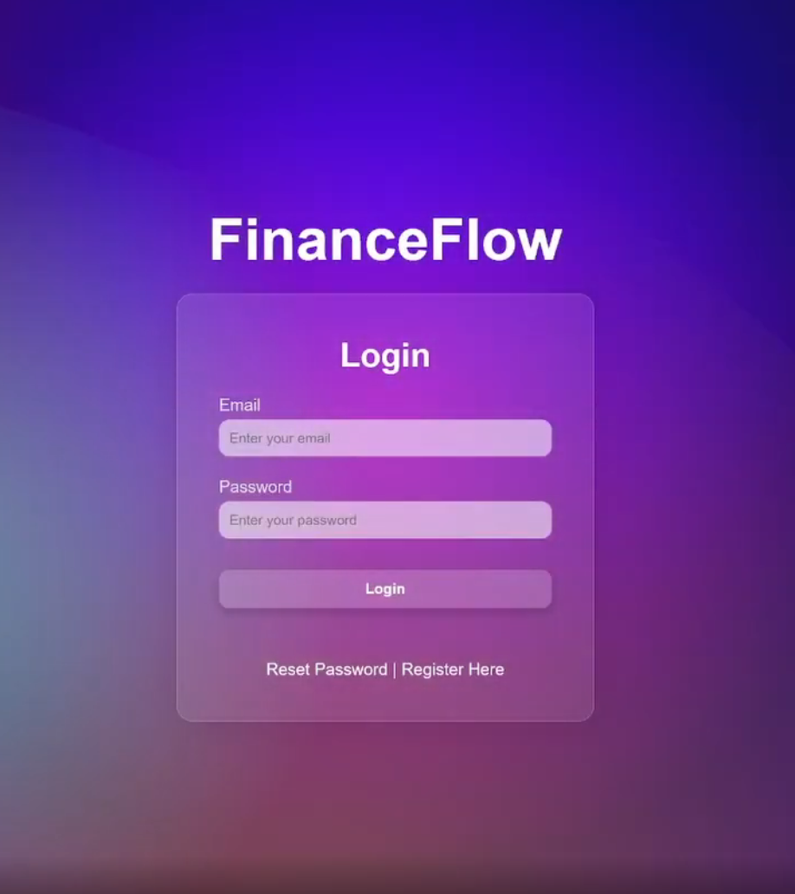
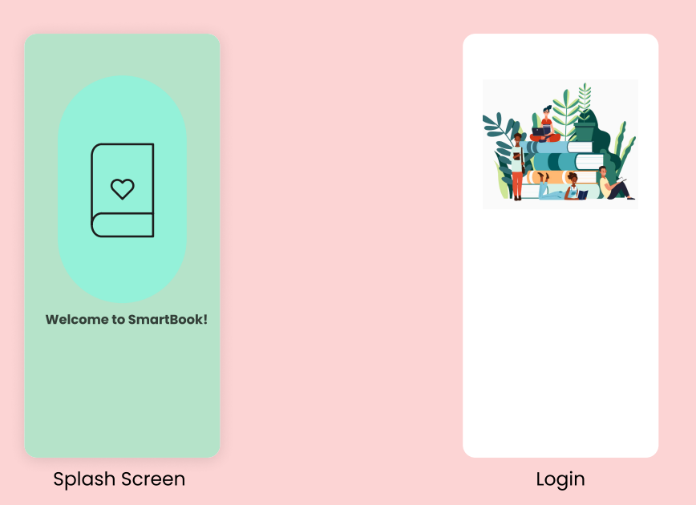

# Vinh Le – Portfolio

Welcome to my personal portfolio website. This site showcases my work, projects, and background as a Computer Science student at Georgia State University (graduating Dec 2025). I specialize in **Python, React, Node.js, SQL, and cloud-based solutions**, and I’m passionate about building data-driven and AI-assisted applications.  

🌐 **Live Site:** https://vinh-le.com/
📄 **Resume:** [Resume Link](https://drive.google.com/file/d/1DQzbgkqcPKxikPOpN7_omq6dCykoadB-/view?usp=drive_link)  
💼 **LinkedIn:** [linkedin.com/in/vinh-le-ab96ba251](https://www.linkedin.com/in/vinh-le-ab96ba251/)  
🐙 **GitHub:** [github.com/vinhbin](https://github.com/vinhbin)

---

## 🚀 Projects

### [FinanceFlow](https://github.com/vinhbin)  
**Tech:** React, Node.js/Express, AWS RDS, Plaid API, OpenAI  
- Secure financial management web app.  
- Features: bank integration, auto transaction categorization, subscription tracking, AI-powered insights, notifications.  
- Deployed on Vercel.  
- 

---

### [SmartBook](https://github.com/vinhbin)  
**Tech:** Flutter, Dart, Firebase, Google Books API  
- Personalized reading companion app.  
- Features: personalized dashboard, book catalog, reading list, reviews, community forum, profile stats.  
- Built with Firebase Auth & Firestore for real-time sync.  
- Solved Firebase rules & review screen loading issues.  
- Future improvements: filters, dark mode, AI recommendations.  
- 

---

### Data Sorting Analysis  
**Tech:** Python, Pandas, NumPy, Matplotlib  
- Optimized pipelines (+30% efficiency).  
- Built visual dashboards to surface trends.  
- Led team of 4 analyzing car reliability & satisfaction.  

---

### Other Projects  
- [Responsive Portfolio](https://kaleidoscopic-dragon-001222.netlify.app/) – HTML/CSS responsive personal site.  
- [Interactive Web Layout](https://spectacular-lokum-587c36.netlify.app/) – Animations + layouts demo.  
- [Simple Landing Page](https://silver-sawine-098aff.netlify.app/) – Minimal landing page design.  
- [Creative Web Concept](https://luminous-croquembouche-dc1e3d.netlify.app/) – Experimental responsive animations.  

---

## 🛠️ Skills
- **Languages:** Java, Python, SQL, JavaScript, HTML/CSS  
- **Frameworks:** React, Node.js, FastAPI, Material-UI  
- **Developer Tools:** Git, Docker, TravisCI, GCP, VS Code, IntelliJ, PyCharm  
- **Libraries:** Pandas, NumPy, Matplotlib  

---

## 📚 Education
**Georgia State University**  
_B.S. in Computer Science (Aug 2022 – Dec 2025)_  
- GPA: 3.5 | Dean’s List

---

## ✨ Quote
> “Be one percent better than you were yesterday.”

---

## 📦 Installation & Setup
To run locally:
```bash
# Clone the repo
git clone https://github.com/vinhbin/portfolio.git

cd portfolio

# Open index.html in your browser
